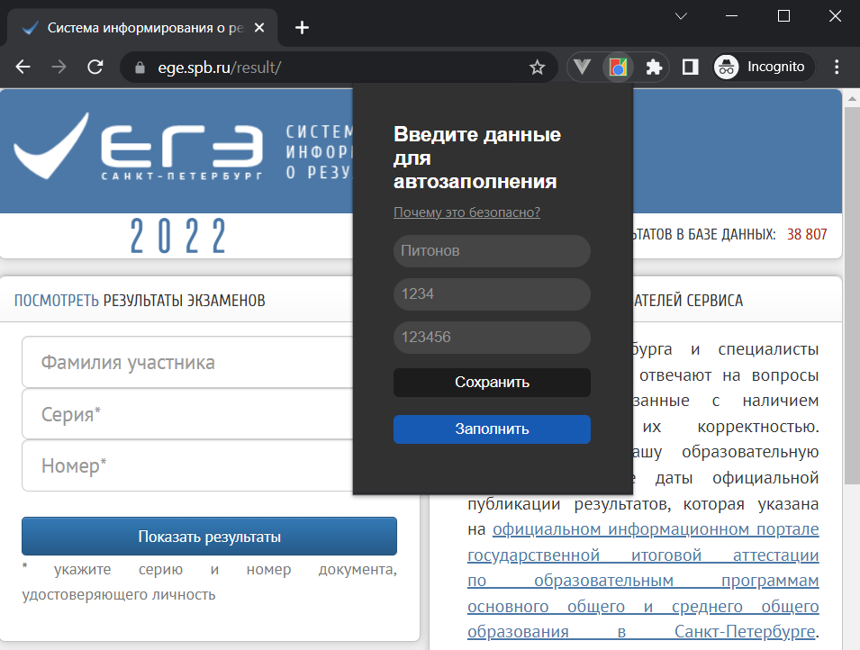
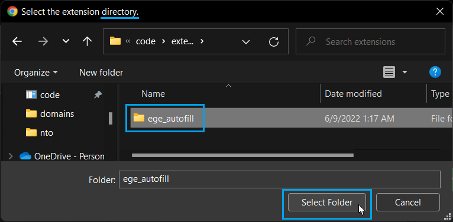

<h1>EGE Autofill</h1>

This simple script for autofill your data on ege.spb.ru/result/
 

<h2>Install</h2>
<ol>
  <li>download last <a href="https://github.com/MohonovProduction/ege-autofill/releases">release</a></li>
  <li>unpack zip archive</li>
  <li>open chrome</li> 
  <li>open settings (from three dots)</li>
  <li>open extensions (from the left sidebar)</li>
  <li>turn on developer mode (on the right top lever)</li>
  <li>click "Load unpacked"</li>
  <li>chose <b><i>folder</i></b> <i>(really choose folder, just click on it and press "select folder")</i> with unpacked archive, how on screen below
  
</ol>

